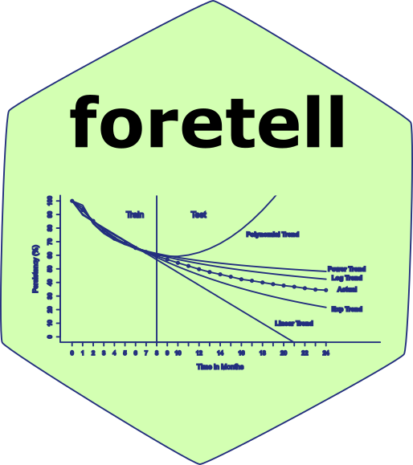

[](https://cran.r-project.org/package=foretell)
[](https://www.gnu.org/licenses/gpl-3.0.en.html)

foretell 
==========================================================

Project Customer Retention based on Fader and Hardie et. al. Probability Mixture Models


## Installation
You can install the **stable** version from
[CRAN](https://cran.r-project.org/package=foretell).


```s
install.packages('foretell', dependencies = TRUE)
```

You can install the **development** version from
[Github](https://github.com/forecaster18/foretell)

```s
# install.packages("devtools")
devtools::install_github("forecaster18/foretell")
```
## Usage

```s
library(foretell)


# Beta Geometric
surv_value <- c(100,86.9,74.3,65.3,59.3)
h <- 6
BG(surv_value,h)

# Beta Discrete Weibull
surv_value <- c(100,86.9,74.3,65.3,59.3)
h <- 6
BdW(surv_value,h)

# Latent Class Discrete Weibull
surv_value <- c(100,86.9,74.3,65.3,59.3,55.1,51.7,49.1,46.8,44.5,42.7,40.9,39.4)
h <- 6
LCW(surv_value,h)


```

## References

* Fader P, Hardie B. How to project customer retention. Journal of Interactive Marketing. 2007;21(1):76-90.
* Fader P, Hardie B, Liu Y, Davin J, Steenburgh T. "How to Project Customer Retention" Revisited: The Role of Duration Dependence. Journal of Interactive Marketing. 2018;43:1-16.

## License

This package is free and open source software, licensed under GPL-3.
